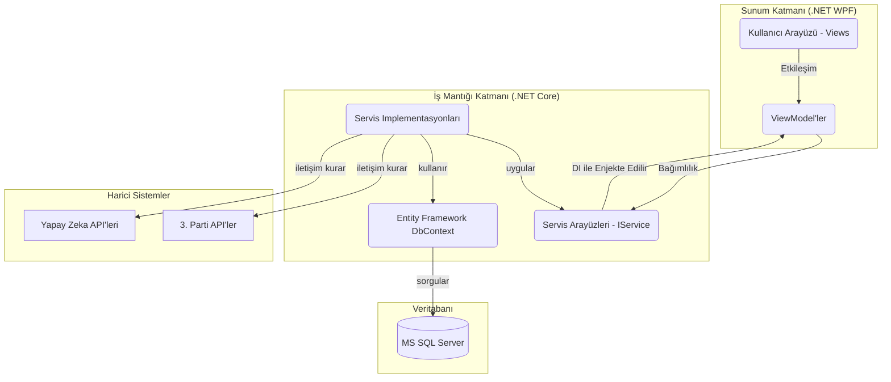

# Rapor 1: Genel Sistem Mimarisi

**Rapor Tarihi:** 14 Ağustos 2025
**Referans Doküman:** `MesTechStok_v1.md` (Bölüm 3)

---

## 1. Amaç

Bu rapor, MesTech Stok yazılımının teknik mimarisini, kullanılan teknolojileri ve tasarım desenlerini, projenin gerçek kod tabanına dayanarak detaylı bir şekilde açıklamaktadır. `MesTechStok_v1.md` dosyasında belirtilen genel yapı, bu dokümanda projenin mevcut .NET tabanlı uygulamasına spesifik olarak uyarlanmıştır.

---

## 2. Düzeltilmiş ve Detaylandırılmış Mimari

Sistem, `MesTechStok_v1.md`'de belirtildiği gibi web tabanlı (PHP/React) bir yapıya sahip **değildir**. Mevcut sistem, **Microsoft .NET 9** platformu üzerinde geliştirilmiş, yüksek performanslı bir **Windows Masaüstü Uygulamasıdır**.

Mimari, 4 ana katmandan oluşur:

### 2.1. Sunum Katmanı (Presentation Layer) - `MesTechStok.Desktop`

Bu katman, kullanıcının doğrudan etkileşime girdiği arayüzü oluşturur.

-   **Teknoloji:** WPF (Windows Presentation Foundation). Zengin, donanım hızlandırmalı ve esnek bir kullanıcı arayüzü sağlar.
-   **Tasarım Deseni:** MVVM (Model-View-ViewModel). Bu desen, UI (View) ile iş mantığını (ViewModel) birbirinden tamamen ayırarak test edilebilirliği ve bakım kolaylığını en üst düzeye çıkarır.
-   **Bileşenler:**
    -   **View'lar:** XAML ile tanımlanan pencereler ve kullanıcı kontrolleri (`ProductsView.xaml`, `SettingsView.xaml`).
    -   **ViewModel'ler:** View'ların arkasındaki C# kodları. Veri bağlama (Data Binding), komutlar (Commands) ve kullanıcı etkileşim mantığını içerir (`ProductsViewModel.cs`).
    -   **Ek Hizmetler:** Bu katmanda, "Ekran Koruyucu" gibi masaüstüne özgü modüllerin mantığı ve tetikleme mekanizmaları yer alır.

### 2.2. İş Mantığı ve Veri Erişim Katmanı (Business & Data Access Layer) - `MesTechStok.Core`

Bu proje, uygulamanın beyni ve çekirdeğidir. Platformdan tamamen bağımsızdır.

-   **Teknoloji:** .NET 9 Standard Kütüphanesi.
-   **Sorumluluklar:**
    -   **Servisler:** Uygulamanın ana iş kurallarını içeren servisler (`IProductService`, `ICustomerService`).
    -   **Varlıklar (Entities):** Veritabanı tablolarını temsil eden C# sınıfları (`Product.cs`).
    -   **Veri Erişimi (Data Access):** Veritabanı işlemleri, **Entity Framework Core 9 (EF Core)** ORM (Object-Relational Mapper) aracı ile yönetilir. Bu, SQL sorgularını C# kodu üzerinden güvenli ve verimli bir şekilde yapmayı sağlar.
    -   **API Entegrasyon Mantığı:** Harici API'lerle (Pazaryerleri, Yapay Zeka servisleri) iletişim kuracak olan `HttpClient` ve ilgili mantık bu katmanda soyutlanmıştır.

### 2.3. Veritabanı Katmanı (Database Layer)

-   **Teknoloji:** **Microsoft SQL Server**. Güçlü, ölçeklenebilir ve güvenilir bir ilişkisel veritabanı yönetim sistemidir.
-   **Şema Yönetimi:** Veritabanı şeması (tablolar, kolonlar, ilişkiler), EF Core'un **Migrations** özelliği ile kod üzerinden yönetilir. Bu, veritabanı yapısının versiyonlanabilir ve tutarlı olmasını sağlar.
-   **Ana Tablolar:** `Products`, `Customers` (oluşturulacak), `StockMovements` (oluşturulacak), `Settings`, `Logs` (oluşturulacak).

### 2.4. Entegrasyon Katmanı (Integration Layer)

Bu katman, fiziksel bir projeden ziyade, `Core` katmanı içinde tanımlanmış ve harici sistemlerle konuşan mantıksal bir bütündür.

-   **API İletişimi:** `.NET`'in yerleşik `HttpClient`'ı ve `IHttpClientFactory` kullanılarak RESTful API'lerle iletişim kurulur.
-   **Yapay Zeka API'leri:**
    -   **Azure AI Services:** .NET ile en uyumlu ve güçlü entegrasyonu sunar.
    -   **OpenAI API:** Metin tabanlı işlemler için.
    -   **Diğerleri:** Gerekli durumlarda herhangi bir REST API ile entegrasyon sağlanabilir.
-   **Güvenlik:** Harici API'lerle iletişimde `TokenRotationService` gibi servisler, kimlik doğrulama token'larının güvenli ve sürekli bir şekilde yönetilmesini sağlar.

---

## 3. Mimari Akış Şeması

Bu yapı, modern, test edilebilir ve bakımı kolay bir masaüstü uygulaması için endüstri standardı bir yaklaşımdır.
