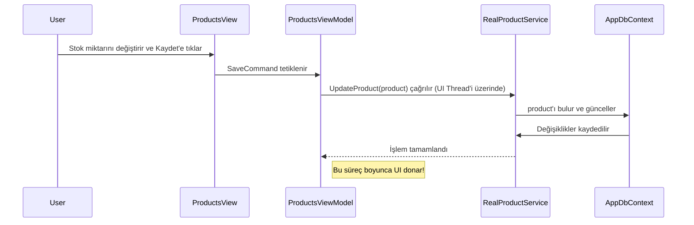

# Rapor 3: Algoritma Akışı ve Veri İşleme Mantığı

**Rapor Tarihi:** 14 Ağustos 2025
**Referans Doküman:** `MesTechStok_v1.md` (Bölüm 6)

---

## 1. Amaç

Bu rapor, MesTech Stok yazılımındaki temel kullanıcı senaryolarının arkasında yatan algoritmik akışları ve veri işleme mantığını, mevcut kod tabanındaki eksiklikleri ve yapılması gereken iyileştirmeleri göz önünde bulundurarak detaylandırmaktadır.

---

## 2. Temel Senaryo: Ürün Stok Güncelleme Akışı

Bu akış, sistemin en temel işlevidir. `MesTechStok_v1.md`'deki akış, projenin gerçek yapısına göre aşağıda detaylandırılmıştır.

### 2.1. Mevcut (Hatalı) Akış

Mevcut kodda, özellikle `async` desenlerinin yanlış kullanımı nedeniyle akış verimsiz ve risklidir.



### 2.2. Önerilen (Doğru) Akış

Doğru ve donmayan bir kullanıcı deneyimi için akış, asenkron programlama prensiplerine uygun olarak yeniden tasarlanmalıdır.

```mermaid
flowchart TD
    A[Kullanıcı "Kaydet" butonuna tıklar] --> B{ViewModel'de ICommand Tetiklenir};
    B --> C{IsBusy = true (Arayüzde ProgressBar gösterilir)};
    C --> D[Task.Run ile işlem arka plan thread'ine atılır];
    D --> E{IProductService.UpdateProductAsync(product) çağrılır};
    E --> F{EF Core, veritabanında UPDATE sorgusu çalıştırır};
    F --> G{İşlem Sonucu (Başarılı/Hatalı) döner};
    G --> H{Dispatcher.Invoke ile UI thread'ine geçilir};
    H --> I{IsBusy = false (ProgressBar gizlenir)};
    I --> J{Kullanıcıya başarı veya hata mesajı gösterilir};
    E -- Hata Olursa --> K{ILogger servisi ile hata loglanır};
    K --> G;
```
- **Anahtar İyileştirme:** `Task.Run` ve `async/await` kullanımı, veritabanı işlemi sürerken kullanıcı arayüzünün tamamen akıcı kalmasını sağlar. `try-catch` blokları ve loglama, hataların sessizce kaybolmasını engeller.

---

## 3. Kritik Senaryo: Harici API ile Senkronizasyon Akışı

Bu akış, `MesTechStok_v1.md`'de belirtilen "API ve Yapay Zeka Servisleri ile Haberleş" adımının somut bir implementasyonudur.

### 3.1. Mevcut Durum

Bu işlevsellik için gerekli olan `SyncRetryService` ve `TokenRotationService` gibi servisler **boş olduğu için bu akış şu anda çalışmamaktadır.**

### 3.2. Önerilen Tasarım ve Akış

Sağlam ve güvenilir bir senkronizasyon mekanizması aşağıdaki adımları içermelidir.

```mermaid
graph TD
    subgraph "UI Katmanı"
        A[Kullanıcı "Senkronize Et" butonuna basar] --> B(ViewModel: SyncCommand);
    end

    subgraph "Servis Katmanı (Arka Plan)"
        C(ISyncService.StartSyncAsync) --> D{ITokenRotationService: Geçerli Token Al};
        D --> E(Polly Retry Politikası ile API'ye İstek);
        E -- Başarısız (Geçici Hata) --> E;
        E -- Başarılı --> F(Gelen JSON Verisini DTO'lara Çözümle);
        F --> G(Veritabanındaki mevcut kayıtlarla karşılaştır);
        G --> H(Toplu Güncelleme/Ekleme - BulkExtensions);
    end

    subgraph "Loglama"
        I((ILogger))
    end

    B --> C;
    C -- Hata --> I;
    D -- Hata --> I;
    E -- Kalıcı Hata --> I;
    H -- Sonuç --> B;
```

- **Polly Kütüphanesi:** `E` adımında, geçici ağ hatalarında veya API'nin meşgul olduğu durumlarda isteği otomatik olarak birkaç kez yeniden deneyen bir "Retry Policy" (Yeniden Deneme Politikası) uygulanmalıdır.
- **Idempotency:** Her senkronizasyon işleminde, harici sistemden gelen verinin daha önce işlenip işlenmediği bir `IdempotencyKey` veya `lastModified` tarihi ile kontrol edilmelidir. Bu, aynı verinin mükerrer olarak kaydedilmesini önler.
- **Bulk Operations:** Yüzlerce veya binlerce kaydı tek seferde güncellemek için standart `SaveChanges` yerine `EFCore.BulkExtensions` gibi bir kütüphane kullanmak, performansı 10 ila 50 kat artırabilir.
