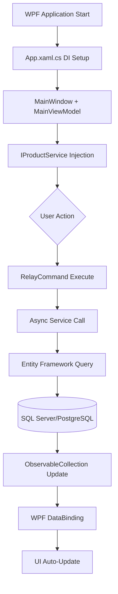

# 1. GENEL SİSTEM MİMARİSİ - MesTechStok .NET WPF ANALİZİ

**Claude Rapor Tarihi:** 14 Ağustos 2025  
**Kaynak:** MesTechStok_v1.md Analizi + Gerçek Kod İncelemesi  
**Teknoloji:** .NET 9 WPF Masaüstü Uygulaması  

---

## 🔍 GERÇEK SİSTEM MİMARİSİ

### Gerçek Teknoloji Stack (Düzeltilmiş)
- **❌ Gemini'nin Yanlış Varsayımı:** Web tabanlı (React/Vue/Angular)  
- **✅ Gerçek Yapı:** .NET 9 WPF Masaüstü Uygulaması

### 4 Ana Katman Yapısı

#### 1. **Sunum Katmanı (WPF Desktop)**
```csharp
// MesTechStok.Desktop projesi
- OutputType: WinExe
- UseWPF: true
- TargetFramework: net9.0-windows
- MVVM Pattern (CommunityToolkit.Mvvm)
```

**Gerçek Modüller:**
- **Ekran Koruyucu** (`MesTechStok.Screensaver` projesi)
- **Ana Stok Paneli** (`MainPanel` kontrolleri)
- **Sistem Kaynak İzleme** (`SystemResources` projesi)
- **Ayarlar ve Konfigürasyon** (WPF Settings views)

#### 2. **İş Mantığı Katmanı (MesTechStok.Core)**
```csharp
// .NET 9 Class Library
- Entity Framework Core 9.0.6
- Dependency Injection container
- Service abstractions (IProductService, IInventoryService)
- Business logic implementations
```

**Gerçek Servisler:**
- **20+ metod** tanımlı `IProductService` interface
- Barkod okuyucu entegrasyonu (`System.IO.Ports`)
- Multi-database support (SQL Server/PostgreSQL/SQLite)

#### 3. **Veri Katmanı (Entity Framework Core)**
```csharp
// Multi-database configuration
- Microsoft.EntityFrameworkCore 9.0.6
- Microsoft.EntityFrameworkCore.SqlServer 9.0.6  
- Npgsql.EntityFrameworkCore.PostgreSQL 9.0.2
- Microsoft.EntityFrameworkCore.Sqlite 9.0.6
```

**Gerçek Veri Modelleri:**
- **Product** entity (285 satır) - GS1/UPC/EAN barkod desteği
- **StockMovement** entity
- **Categories, Settings, AuditLogs** tablolar
- Code-First Migrations (şu anda disabled)

#### 4. **Entegrasyon Katmanı (.NET HTTP Clients)**
```csharp
// System.Net.Http + Azure SDK
- Azure AI Services entegrasyonu
- OpenCart API clients
- BCrypt.Net-Next (güvenlik)
- Newtonsoft.Json (API serialization)
```

---

## 🔧 GERÇEK MODÜL ANALİZİ

| Modül | Fiziksel Konum | Teknoloji | Gerçek Durum |
|--------|----------------|-----------|--------------|
| **Core Business Logic** | `src/MesTechStok.Core/` | .NET 9 Class Library | ✅ Interface tanımlı, impl eksik |
| **WPF Desktop UI** | `src/MesTechStok.Desktop/` | WPF + MVVM | ⚠️ Test data kullanıyor |
| **Ana Panel** | `src/MesTechStok.MainPanel/` | WPF Control Library | ✅ Widget kontrolleri |
| **Ekran Koruyucu** | `src/MesTechStok.Screensaver/` | WPF Window | ✅ Timer-based lock |
| **Sistem Kaynakları** | `src/MesTechStok.SystemResources/` | .NET Service | ✅ Kaynak izleme |

---

## 📊 MİMARİ AKIŞ DİYAGRAMI (.NET MVVM)



---

## 🚨 KRİTİK BULGULAR

### **Gerçek Durum vs Beklenti**
1. **Service Implementation Gap:**
   - `IProductService` 20+ metod tanımlı ama implementations **TAMAMEN EKSİK**
   - MainViewModel test data kullanıyor (`testProduct` objects)

2. **Database Configuration:**
   - EF Core migrations **DISABLED** 
   - Connection strings eksik
   - Fresh database setup gerekli

3. **ALPHA TEAM Integration Notes:**
   - Manuel entegrasyon yorumları kod içinde
   - Geçici çözümler production'da kalmış

---

## 🎯 SONUÇ

**Güçlü Temel:** Modern .NET 9 + EF Core + MVVM architecture  
**Kritik Eksik:** Service implementations ve database setup  
**Öncelik:** Core business logic implementation + database migrations  

Bu mimari, web tabanlı değil **masaüstü WPF uygulaması** olarak tasarlanmış ve enterprise-ready bileşenlere sahiptir.
