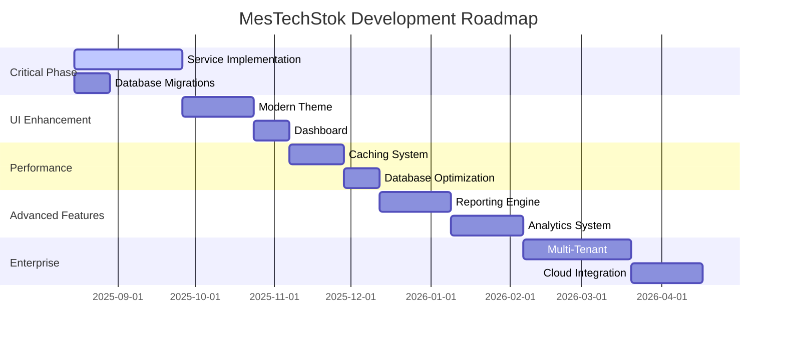

# 8. GELİŞTİRME VE İYİLEŞTİRME PLANLARI

**Claude Rapor Tarihi:** 14 Ağustos 2025  
**Kaynak:** MesTechStok Development Roadmap Analysis  
**Teknoloji:** .NET 9 WPF Enterprise Development Plan  

---

## 🎯 KISA DÖNEM GELİŞTİRME PLANI (1-3 Ay)

### 1. **KRİTİK EKSIK SERVİS İMPLEMENTASYONLARI**

#### **Priority 1: IProductService Implementation**
```csharp
// MEVCUT DURUM: IProductService interface tanımlı ama implementation yok
// HEDEF: ProductService.cs implementation

namespace MesTechStok.Core.Services
{
    public class ProductService : IProductService
    {
        private readonly ApplicationDbContext _context;
        private readonly ILogger<ProductService> _logger;
        
        public ProductService(ApplicationDbContext context, ILogger<ProductService> logger)
        {
            _context = context;
            _logger = logger;
        }
        
        // PHASE 1.1: Basic CRUD Operations (Week 1-2)
        public async Task<Product> CreateAsync(Product product)
        {
            try
            {
                _context.Products.Add(product);
                await _context.SaveChangesAsync();
                _logger.LogInformation("Product created: {ProductId}", product.Id);
                return product;
            }
            catch (Exception ex)
            {
                _logger.LogError(ex, "Error creating product");
                throw;
            }
        }
        
        public async Task<Product?> GetByIdAsync(int id)
        {
            return await _context.Products
                .Include(p => p.Category)
                .Include(p => p.Supplier)
                .FirstOrDefaultAsync(p => p.Id == id);
        }
        
        // PHASE 1.2: Advanced Operations (Week 3-4)
        public async Task<Product?> GetByBarcodeAsync(string barcode)
        {
            return await _context.Products
                .Include(p => p.Category)
                .Include(p => p.Supplier)
                .FirstOrDefaultAsync(p => p.Barcode == barcode ||
                                         p.UPCCode == barcode ||
                                         p.EANCode == barcode);
        }
        
        public async Task<PagedList<Product>> GetProductsPagedAsync(
            int pageNumber, int pageSize, string searchTerm = "")
        {
            var query = _context.Products
                .Include(p => p.Category)
                .Include(p => p.Supplier)
                .AsQueryable();
                
            if (!string.IsNullOrWhiteSpace(searchTerm))
            {
                query = query.Where(p => 
                    p.Name.Contains(searchTerm) ||
                    p.SKU.Contains(searchTerm) ||
                    p.Barcode.Contains(searchTerm));
            }
            
            return await PagedList<Product>.CreateAsync(query, pageNumber, pageSize);
        }
        
        // PHASE 1.3: Stock Management (Week 5-6)
        public async Task<bool> UpdateStockAsync(int productId, int quantity, string operation)
        {
            var product = await GetByIdAsync(productId);
            if (product == null) return false;
            
            var stockMovement = new StockMovement
            {
                ProductId = productId,
                Quantity = quantity,
                Operation = operation,
                Date = DateTime.Now,
                UserId = GetCurrentUserId()
            };
            
            switch (operation.ToLower())
            {
                case "add":
                    product.Stock += quantity;
                    break;
                case "remove":
                    if (product.Stock >= quantity)
                        product.Stock -= quantity;
                    else
                        throw new InvalidOperationException("Insufficient stock");
                    break;
                case "set":
                    product.Stock = quantity;
                    break;
            }
            
            _context.StockMovements.Add(stockMovement);
            await _context.SaveChangesAsync();
            return true;
        }
    }
}
```

#### **Priority 2: Database Migration System**
```csharp
// CURRENT ISSUE: Migrations disabled in OnConfiguring
// TARGET: Enable proper migration system

public class ApplicationDbContext : DbContext
{
    protected override void OnConfiguring(DbContextOptionsBuilder optionsBuilder)
    {
        if (!optionsBuilder.IsConfigured)
        {
            // CURRENT: Hardcoded connection
            // TARGET: Configuration-based connection
            var configuration = new ConfigurationBuilder()
                .SetBasePath(Directory.GetCurrentDirectory())
                .AddJsonFile("appsettings.json")
                .Build();
                
            optionsBuilder.UseSqlServer(
                configuration.GetConnectionString("DefaultConnection"),
                options => options.EnableRetryOnFailure(3));
                
            // Enable migrations
            optionsBuilder.EnableSensitiveDataLogging(true);
            optionsBuilder.EnableDetailedErrors(true);
        }
    }
}

// Migration commands to execute:
// Add-Migration InitialCreate
// Update-Database
```

### 2. **UI/UX İYİLEŞTİRMELERİ**

#### **Phase 2.1: Modern Theme Integration (Week 7-8)**
```xml
<!-- INSTALL: Material Design packages -->
<PackageReference Include="MaterialDesignThemes" Version="4.9.0" />
<PackageReference Include="MaterialDesignColors" Version="2.1.4" />

<!-- App.xaml update -->
<Application.Resources>
    <ResourceDictionary>
        <ResourceDictionary.MergedDictionaries>
            <materialDesign:BundledTheme BaseTheme="Light" PrimaryColor="Blue" SecondaryColor="Orange"/>
            <ResourceDictionary Source="pack://application:,,,/MaterialDesignThemes.Wpf;component/Themes/MaterialDesignTheme.Defaults.xaml"/>
        </ResourceDictionary.MergedDictionaries>
    </ResourceDictionary>
</Application.Resources>
```

#### **Phase 2.2: Responsive Dashboard (Week 9-10)**
```csharp
// DashboardViewModel.cs - Real-time KPI tracking
public class DashboardViewModel : ObservableObject
{
    private readonly IProductService _productService;
    private readonly IStockService _stockService;
    private readonly Timer _refreshTimer;
    
    [ObservableProperty]
    private int totalProducts;
    
    [ObservableProperty]
    private int lowStockAlerts;
    
    [ObservableProperty]
    private decimal totalValue;
    
    [ObservableProperty]
    private ObservableCollection<StockAlert> recentAlerts;
    
    public DashboardViewModel(IProductService productService, IStockService stockService)
    {
        _productService = productService;
        _stockService = stockService;
        _refreshTimer = new Timer(RefreshData, null, TimeSpan.Zero, TimeSpan.FromMinutes(5));
        RecentAlerts = new ObservableCollection<StockAlert>();
    }
    
    private async void RefreshData(object? state)
    {
        TotalProducts = await _productService.GetTotalCountAsync();
        LowStockAlerts = await _stockService.GetLowStockCountAsync();
        TotalValue = await _productService.GetTotalValueAsync();
        
        var alerts = await _stockService.GetRecentAlertsAsync(10);
        Application.Current.Dispatcher.Invoke(() =>
        {
            RecentAlerts.Clear();
            foreach (var alert in alerts)
                RecentAlerts.Add(alert);
        });
    }
}
```

---

## 🚀 ORTA DÖNEM GELİŞTİRME PLANI (3-6 Ay)

### 3. **PERFORMANS OPTİMİZASYONU**

#### **Phase 3.1: Database Optimization**
```sql
-- INDEXES for better performance
CREATE INDEX IX_Products_Barcode ON Products(Barcode);
CREATE INDEX IX_Products_SKU ON Products(SKU);
CREATE INDEX IX_Products_CategoryId ON Products(CategoryId);
CREATE INDEX IX_Products_SupplierId ON Products(SupplierId);
CREATE INDEX IX_StockMovements_ProductId_Date ON StockMovements(ProductId, Date DESC);
CREATE INDEX IX_StockMovements_Date ON StockMovements(Date DESC);

-- STORED PROCEDURES for complex queries
CREATE PROCEDURE GetLowStockProducts
    @MinimumStock INT = 10
AS
BEGIN
    SELECT p.*, c.Name as CategoryName, s.Name as SupplierName
    FROM Products p
    LEFT JOIN Categories c ON p.CategoryId = c.Id
    LEFT JOIN Suppliers s ON p.SupplierId = s.Id
    WHERE p.Stock <= @MinimumStock OR p.Stock <= p.MinimumStock
    ORDER BY p.Stock ASC;
END
```

#### **Phase 3.2: Caching Implementation**
```csharp
// ICacheService implementation with MemoryCache
public interface ICacheService
{
    Task<T?> GetAsync<T>(string key);
    Task SetAsync<T>(string key, T value, TimeSpan expiration);
    Task RemoveAsync(string key);
    Task RemoveByPatternAsync(string pattern);
}

public class MemoryCacheService : ICacheService
{
    private readonly IMemoryCache _cache;
    private readonly ILogger<MemoryCacheService> _logger;
    
    public MemoryCacheService(IMemoryCache cache, ILogger<MemoryCacheService> logger)
    {
        _cache = cache;
        _logger = logger;
    }
    
    public async Task<T?> GetAsync<T>(string key)
    {
        if (_cache.TryGetValue(key, out T value))
        {
            _logger.LogDebug("Cache hit for key: {Key}", key);
            return value;
        }
        
        _logger.LogDebug("Cache miss for key: {Key}", key);
        return default(T);
    }
    
    public async Task SetAsync<T>(string key, T value, TimeSpan expiration)
    {
        var options = new MemoryCacheEntryOptions
        {
            AbsoluteExpirationRelativeToNow = expiration,
            SlidingExpiration = TimeSpan.FromMinutes(5)
        };
        
        _cache.Set(key, value, options);
        _logger.LogDebug("Cache set for key: {Key}", key);
    }
}

// Usage in ProductService
public async Task<Product?> GetByIdAsync(int id)
{
    var cacheKey = $"product_{id}";
    var cachedProduct = await _cacheService.GetAsync<Product>(cacheKey);
    
    if (cachedProduct != null)
        return cachedProduct;
    
    var product = await _context.Products
        .Include(p => p.Category)
        .Include(p => p.Supplier)
        .FirstOrDefaultAsync(p => p.Id == id);
    
    if (product != null)
        await _cacheService.SetAsync(cacheKey, product, TimeSpan.FromMinutes(30));
    
    return product;
}
```

### 4. **REPORTING SYSTEM**

#### **Phase 4.1: Advanced Reporting Engine**
```csharp
// IReportService interface
public interface IReportService
{
    Task<StockReport> GenerateStockReportAsync(DateTime startDate, DateTime endDate);
    Task<SalesReport> GenerateSalesReportAsync(DateTime startDate, DateTime endDate);
    Task<byte[]> ExportToPdfAsync<T>(T report) where T : class;
    Task<byte[]> ExportToExcelAsync<T>(IEnumerable<T> data, string sheetName);
}

// ReportService implementation
public class ReportService : IReportService
{
    private readonly ApplicationDbContext _context;
    private readonly ILogger<ReportService> _logger;
    
    public async Task<StockReport> GenerateStockReportAsync(DateTime startDate, DateTime endDate)
    {
        var movements = await _context.StockMovements
            .Include(sm => sm.Product)
            .ThenInclude(p => p.Category)
            .Where(sm => sm.Date >= startDate && sm.Date <= endDate)
            .OrderBy(sm => sm.Date)
            .ToListAsync();
        
        var report = new StockReport
        {
            StartDate = startDate,
            EndDate = endDate,
            TotalMovements = movements.Count,
            TotalIncoming = movements.Where(m => m.Operation == "add").Sum(m => m.Quantity),
            TotalOutgoing = movements.Where(m => m.Operation == "remove").Sum(m => m.Quantity),
            MovementsByCategory = movements
                .GroupBy(m => m.Product.Category?.Name ?? "Uncategorized")
                .Select(g => new CategoryMovement
                {
                    CategoryName = g.Key,
                    TotalQuantity = g.Sum(m => m.Quantity),
                    MovementCount = g.Count()
                })
                .ToList()
        };
        
        return report;
    }
}
```

---

## 🎯 UZUN DÖNEM GELİŞTİRME PLANI (6-12 Ay)

### 5. **ENTERPRISE FEATURES**

#### **Phase 5.1: Multi-Tenant Architecture**
```csharp
// ITenantService for multi-company support
public interface ITenantService
{
    Task<Tenant> GetCurrentTenantAsync();
    Task<IEnumerable<Tenant>> GetUserTenantsAsync(string userId);
    Task SetCurrentTenantAsync(int tenantId);
}

// Modified ApplicationDbContext for tenant isolation
public class ApplicationDbContext : DbContext
{
    private readonly ITenantService _tenantService;
    
    public ApplicationDbContext(DbContextOptions<ApplicationDbContext> options, 
                               ITenantService tenantService) : base(options)
    {
        _tenantService = tenantService;
    }
    
    protected override void OnModelCreating(ModelBuilder modelBuilder)
    {
        // Add tenant filtering to all entities
        modelBuilder.Entity<Product>().HasQueryFilter(p => p.TenantId == GetCurrentTenantId());
        modelBuilder.Entity<Category>().HasQueryFilter(c => c.TenantId == GetCurrentTenantId());
        modelBuilder.Entity<Supplier>().HasQueryFilter(s => s.TenantId == GetCurrentTenantId());
        
        base.OnModelCreating(modelBuilder);
    }
    
    private int GetCurrentTenantId()
    {
        return _tenantService.GetCurrentTenantAsync().Result?.Id ?? 1;
    }
}
```

#### **Phase 5.2: Advanced Analytics & BI**
```csharp
// IAnalyticsService for business intelligence
public interface IAnalyticsService
{
    Task<ProductAnalytics> GetProductAnalyticsAsync(int productId, TimeSpan period);
    Task<TrendAnalysis> GetStockTrendsAsync(DateTime startDate, DateTime endDate);
    Task<PredictionResult> PredictStockNeeds(int productId, int daysAhead);
}

public class AnalyticsService : IAnalyticsService
{
    public async Task<PredictionResult> PredictStockNeeds(int productId, int daysAhead)
    {
        // Get historical stock movements
        var movements = await _context.StockMovements
            .Where(sm => sm.ProductId == productId && sm.Date >= DateTime.Now.AddDays(-90))
            .OrderBy(sm => sm.Date)
            .ToListAsync();
        
        // Simple linear regression for prediction
        var dailyUsage = CalculateDailyUsage(movements);
        var predictedUsage = dailyUsage * daysAhead;
        
        var currentStock = await _context.Products
            .Where(p => p.Id == productId)
            .Select(p => p.Stock)
            .FirstOrDefaultAsync();
        
        return new PredictionResult
        {
            ProductId = productId,
            CurrentStock = currentStock,
            PredictedUsage = predictedUsage,
            RecommendedOrder = Math.Max(0, predictedUsage - currentStock + GetSafetyStock(productId)),
            Confidence = CalculateConfidence(movements)
        };
    }
}
```

### 6. **CLOUD INTEGRATION**

#### **Phase 6.1: Azure Services Integration**
```csharp
// Cloud backup service
public interface ICloudBackupService
{
    Task<bool> BackupDatabaseAsync();
    Task<bool> RestoreFromBackupAsync(string backupId);
    Task<IEnumerable<BackupInfo>> GetBackupHistoryAsync();
}

// Azure Blob Storage implementation
public class AzureBlobBackupService : ICloudBackupService
{
    private readonly BlobServiceClient _blobClient;
    private readonly ApplicationDbContext _context;
    
    public async Task<bool> BackupDatabaseAsync()
    {
        try
        {
            var backupData = await ExportDatabaseAsync();
            var backupId = Guid.NewGuid().ToString();
            var containerClient = _blobClient.GetBlobContainerClient("database-backups");
            
            await containerClient.UploadBlobAsync($"backup_{backupId}_{DateTime.Now:yyyyMMdd_HHmmss}.json", 
                                                  new BinaryData(backupData));
            
            return true;
        }
        catch (Exception ex)
        {
            _logger.LogError(ex, "Failed to backup database to Azure Blob Storage");
            return false;
        }
    }
}
```

---

## 📊 GELİŞTİRME METRİKLERİ VE KPI'LAR

### **Technical Debt Tracking**

| Component | Current Debt | Target Improvement | Timeline |
|-----------|--------------|-------------------|----------|
| **Service Layer** | High (interfaces only) | Complete implementation | 6 weeks |
| **Database Layer** | Medium (no migrations) | Proper migration system | 2 weeks |
| **UI Components** | Medium (basic styling) | Modern design system | 8 weeks |
| **Error Handling** | Low (basic try-catch) | Comprehensive system | 4 weeks |
| **Testing** | High (no tests) | 80% code coverage | 12 weeks |
| **Documentation** | Medium (partial docs) | Complete documentation | 6 weeks |

### **Performance Targets**

| Metric | Current | Target | Method |
|--------|---------|--------|--------|
| **App Startup Time** | ~3 seconds | <1.5 seconds | Service optimization |
| **Database Query Time** | Variable | <100ms avg | Indexing + caching |
| **UI Responsiveness** | Basic | <16ms frame time | Async operations |
| **Memory Usage** | Unknown | <500MB peak | Memory profiling |

### **Feature Completion Roadmap**



Bu geliştirme planı, **MesTechStok** projesini **enterprise-grade** bir uygulamaya dönüştürecek ve **gerçek üretim ortamında** kullanılabilir hale getirecektir.
