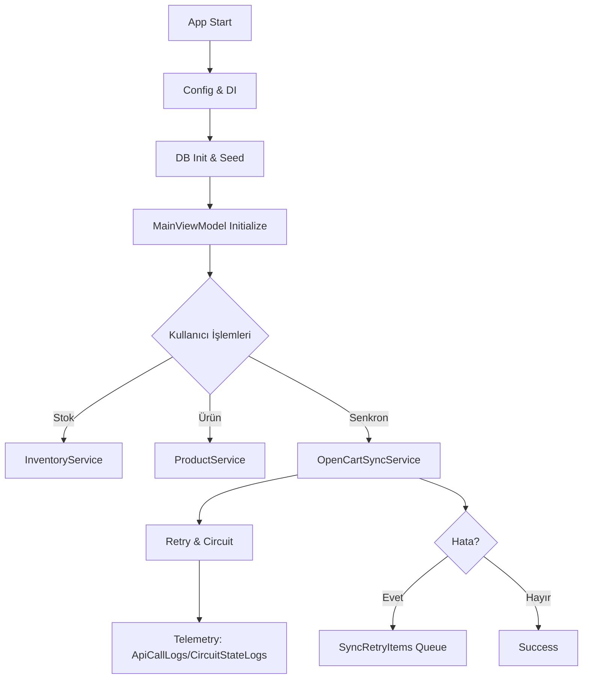

## Başlatma Akışı
1. Uygulama açılışı → Serilog kurulumu → Çalışma dizini set edilir.
2. Konfigürasyon: `appsettings.json` (opsiyonel `appsettings.user.json` override).
3. DI konteyner kurulumu, `ServiceLocator` köprülemesi.
4. DB başlangıcı: `InitializeDatabaseAsync` → EF şema/seed yardımcıları (`Ensure*` yardımcıları).
5. Monitoring servisleri başlatılır; `MainViewModel.InitializeAsync` veri yükler.

## Stok İşleme Akışı
1. Ürün liste/yükleme → `ProductService`.
2. Stok hareketi → `InventoryService` → `StockMovements` yazımı ve indeksli sorgular.
3. Kritik stok/yeniden sipariş seviyeleri UI’da işaretlenir.

## OpenCart Senkronizasyonu (Özet)
1. `OpenCartSyncService.FullSyncAsync` → ürün içe/ dışa aktarım + sipariş çekimi.
2. Her adımda korelasyon ID oluşturulur; başarı/hata telemetrisi yazılır.
3. Hatalar için `SyncRetryService.AddRetryItemAsync` ile kuyruk.

## Dayanıklılık Akışı
- HTTP istekleri `RetryAndCorrelationHandler` üzerinden geçer:
  - Üstel backoff + jitter → yeniden deneme telemetrisi.
  - Pencere bazlı fail oranı → open/half-open/closed devre durumu.
  - `X-Correlation-ID` başlığı eklenir.
- `EnhancedCircuitBreaker` (Core genel kullanımı için) metrik toplar, durum geçişleri yayınlar.

## Mermaid Diyagramı

